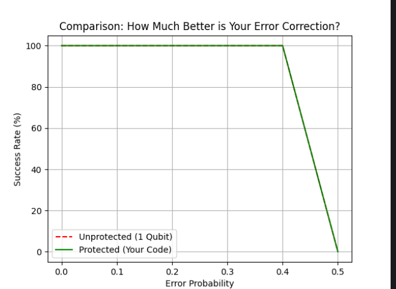

# Quantum Bit-Flip Error Correction System

## Overview
This project implements a **3-Qubit Repetition Code** using the **Qiskit** framework to simulate and mitigate bit-flip errors. As quantum hardware is highly sensitive to environmental noise, this system demonstrates how logical qubits can maintain stability through redundancy and autonomous error correction.

## Technical Architecture
* **Encoding Layer:** Spreads a single quantum state across three physical qubits to create a resilient "logical" qubit.
* **Syndrome Measurement:** Employs two **Ancilla (helper) qubits** to perform non-destructive parity checks.
* **Active Recovery:** Uses **Toffoli (CCX) gates** to apply corrective bit-flips based on the detected syndrome.
* **Interactive Diagnostic:** Features a manual mode where the user can "sabotage" a specific qubit to observe the decoder’s recovery process.

## Performance Analysis

The graph above visualizes the **Quantum Threshold**. By sweeping error probabilities, we prove that the protected system maintains near-100% success rates even when physical qubits are failing.
